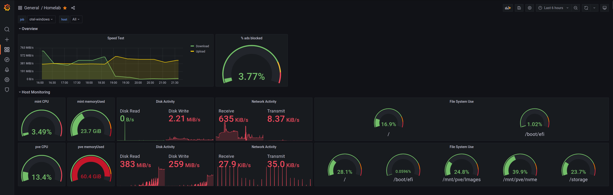

# Summary
docker-compose setup for homelab monitoring



# Details

## Stack:
- Prometheus: Metrics Storage
- Loki: Log storage
- promtail: Docker Log Scraping
- Grafana: Dashboards / analysis
- OpenTelemetry: Host metrics + agent + translation
- snmp-exporter: publish prometheus stats from snmp (router stats)
- pi-hole-exporter: Prometheus statistics from pi-hole

## Enviroment variables:

This file is intentionally NOT stored in the repository to prevent passwords and other senstive information from being imported into this repository. Username and password must be configured for the pi-hole scraper. Storage can be set to what ever location is desired

.env is as follows:
```
PI_HOLE_USERNAME=username 
PI_HOLE_PASSWORD=password

USERNUM=1000
LOKI_STORAGE=~/homelab-monitoring/loki/
PROMTAIL_STORAGE=~/homelab-monitoring/promtail/
GRAFANA_STORAGE=~/homelab-monitoring/grafana/
PROMETHEUS_STORAGE=~/homelab-monitoring/prometheus/

PVE_USER=metrics@pve
PVE_TOKEN_NAME=<Proxmox token name>
PVE_TOKEN_VALUE=<Proxmox token>
PVE_VERIFY_SSL=false

DOMAIN=example.com
CF_API_EMAIL=<email address>
CF_DNS_API_TOKEN=<cloud flare api token>
BASIC_AUTH=<Hashed password>
```
note: usernum is used to allow the containers write permissions to the mapped volumes

## Traefik config

### Cloudflare API Token
Permissions
- "Zone, Zone, READ" 
- "Zone, DNS, EDIT" 

Zone Resources
- "Include, Specific Zone, example.com"

### Basic Auth

BASIC_AUTH needs to have the username and password hashed
- `htpasswd -nb <USER> <PASSWORD>`

## External configuration
promtail is configured to scrape docker logs from the host machine.
- Configuration instructions are available here: https://techno-tim.github.io/posts/grafana-loki/
- See "Loki Docker Driver"
    


## Ports exposed on host

    3100 : Loki
    3000 : grafana 
    9090 : Prometheus
    9116 : snmp exporter
    9617 : pi-hole-exporter

    8086 : otel Influx reciever
    8888 : otel prometheus metrics
    9101 : prometheus metrics from influx metrics
    13133: otel healthcheck
    55679: otel zpages for trouble shooting

